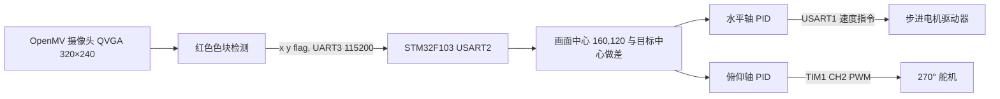

# OpenMV + STM32F103 二维目标追踪云台

这是一个 **OpenMV 视觉上位机 + STM32F103 执行下位机** 的二轴云台实验工程。OpenMV 识别画面中最大的红色色块，把中心像素坐标发给 STM32；STM32 使用两路 PID 控制，让目标尽量回到画面中心。

> 请按源码理解本项目：**水平轴使用 Emm V5 协议步进电机，俯仰轴使用 270° 舵机**。它是红色目标追踪程序，没有拼图碎片识别、拼接规划或搬运流程。源码文件时间和控制逻辑也无法证明它是“2025 年 H 题拼图装置”的完整实现。

## 工作流程



`flag=1` 表示检测到目标；`flag=0` 表示目标丢失。目标丢失时固件清除 PID 状态，停止步进电机，并保持舵机的当前位置。控制链不使用实际角度反馈；这里的“闭环”是**图像误差闭环**，电机驱动器内部的闭环能力取决于所用型号和设置。

## 仓库结构

| 路径 | 内容 |
| --- | --- |
| [`openmv/main.py`](openmv/main.py) | 从提供的 OpenMV 脚本整理的视觉发送端 |
| [`firmware/Core/Src/main.c`](firmware/Core/Src/main.c) | STM32 初始化、OpenMV 串口接收和定时器回调 |
| [`firmware/Core/Src/core.c`](firmware/Core/Src/core.c) | PID 调度、目标丢失处理、水平轴速度映射 |
| [`firmware/Core/Src/PID.c`](firmware/Core/Src/PID.c) | PID 计算 |
| [`firmware/Core/Src/tim.c`](firmware/Core/Src/tim.c) | 俯仰舵机 PWM |
| [`firmware/Core/Src/Emm_v5.c`](firmware/Core/Src/Emm_v5.c) | 本项目所需的最小步进电机速度指令编码器 |
| `firmware/2DServoGP.ioc` | STM32CubeMX 外设与引脚配置 |
| `firmware/Drivers/` | 编译所需的 ST HAL 和 CMSIS 组件，保留各自许可证 |
| [`docs/hardware.md`](docs/hardware.md) | 接线、电源、校准与联调 |
| [`docs/protocol.md`](docs/protocol.md) | 串口格式和参数解释 |

## 快速开始

### 1. 准备环境

下位机的 `.ioc` 目标器件是 `STM32F103C8Tx`，使用 **CMake ≥3.22、Ninja、arm-none-eabi-gcc** 编译；也可用 `firmware/2DServoGP.ioc` 查看 CubeMX 配置。OpenMV 端在支持 `sensor`、`image` 和 `pyb.UART` 的 OpenMV 固件中运行，不能用桌面 CPython 直接运行。

### 2. 编译固件

```bash
cd firmware
cmake --preset Release
cmake --build --preset Release
```

输出为 `firmware/build/Release/2DServoGP.elf`。用适合自己开发板的 SWD/ST-Link 烧录工具写入并验证。更改 `.ioc` 后重新生成代码时，应先备份 `Core/` 中的手写内容并检查差异。

### 3. 运行 OpenMV

在 OpenMV IDE 中打开 `openmv/main.py`，先查看红色色块框和中心十字是否稳定。确认阈值及镜头方向后，再保存为板上 `main.py` 并运行。源码采用 `UART(3, 115200)`；实际 TX 引脚因 OpenMV 板型不同，应查对应板卡引脚图。

### 4. 分阶段联调

先不接执行机构，核对 OpenMV 发送的 `x y flag`；再检查 STM32 串口收数；随后只接步进驱动器，最后接舵机。检查目标从左/右、上/下移动时两轴方向是否相反地纠正偏差。实物联调前阅读 [硬件与联调说明](docs/hardware.md)。

## 关键参数

| 参数 | 当前值 | 所在位置 |
| --- | ---: | --- |
| 图像大小 | 320 × 240 | `openmv/main.py` 的 `sensor.QVGA` |
| 目标中心 | `(160, 120)` 像素 | `firmware/Core/Src/core.c` |
| OpenMV 串口 | UART3，115200，8N1 | `openmv/main.py` |
| STM32 输入 | USART2，PA3 RX，115200 | `firmware/Core/Src/usart.c` |
| 水平步进驱动 | USART1，PB6 TX，115200 | `firmware/Core/Src/usart.c` |
| 俯仰舵机 | TIM1 CH2，PA9 PWM | `firmware/Core/Src/tim.c` |
| X 轴 PID | Kp=2.3，Ki=0，Kd=5 | `firmware/Core/Src/main.c` |
| Y 轴 PID | Kp=6.3，Ki=0，Kd=3 | `firmware/Core/Src/main.c` |
| 水平死区 | ±2 像素 | `firmware/Core/Src/core.c` |

红色阈值是现场光照下的经验值，须在 OpenMV IDE 阈值编辑器中重新校准。云台零位、步进电机方向、舵机行程和供电也要按实物验证。

## 本次公开整理的改动

原始工程中有带第三方署名、但未见明确再发布许可的电机示例代码。本仓库保留实际使用的协议行为，用一个**只编码速度指令**的最小实现替代；未使用的示例 FIFO/驱动函数不发布。还补了 OpenMV 三元组的长度与范围检查，并修正丢失目标时舵机 PWM 保持值的计算。这些整理改动已通过 ARM GCC Release 编译，**尚无实物测试记录**。

## 已知限制

- 目前只追踪最大的红色色块，不能辨识动物、拼图、多个目标或深度距离。
- OpenMV 串口帧以空格结尾、依靠接收空闲中断划分；没有帧头、校验和、序号或超时保护。干扰环境中应升级协议。
- 俯仰轴是舵机，当前 TIM1 周期为 40 ms（25 Hz）。不同舵机的可用周期及脉宽必须实测确认。
- 固件中的 PID 数值是该样机的经验参数。电机反向或触及行程时必须重新调参并增加限位保护。

## 许可

本仓库自写的应用代码和文档以 [MIT License](LICENSE) 开源。`firmware/Drivers/` 的 ST HAL 与 CMSIS 文件保留原许可证；详见 [第三方组件说明](THIRD_PARTY_NOTICES.md)。

