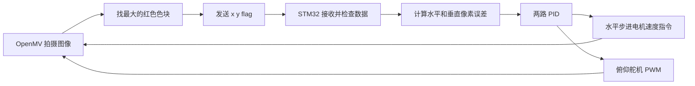

# 视觉瞄准算法具体实现

本文按照仓库**现有代码实际执行的路径**，解释从 OpenMV 找到红色目标，到 STM32 驱动二维云台的全过程。阅读时可同时打开 [`openmv/main.py`](../openmv/main.py)、[`firmware/Core/Src/main.c`](../firmware/Core/Src/main.c)、[`firmware/Core/Src/PID.c`](../firmware/Core/Src/PID.c)、[`firmware/Core/Src/core.c`](../firmware/Core/Src/core.c) 和 [`firmware/Core/Src/tim.c`](../firmware/Core/Src/tim.c)。

这里实现的是 2025 年电赛 E 题“简易自行瞄准装置”的**红色目标视觉跟踪与云台控制模块**。代码尚未实现靶心识别、激光控制、小车寻迹或整题规定的瞄准精度测试；不能把“红色色块位于画面中心”直接等同于“激光命中靶心”。

## 1. 整体思路

相机固定在云台上，以图像中心 `(160, 120)` 为参考位置。OpenMV 每拍一帧，找到红色色块中心 `(x, y)`；STM32 计算它与图像中心的偏差，分别调整水平步进电机和俯仰舵机。下一帧再测量新的偏差，如此循环。



这是**图像误差闭环**：反馈量是目标在画面中的像素位置。STM32 没有读取云台实际角度或激光落点。

## 2. OpenMV：从图像取得目标坐标

### 2.1 采集和颜色阈值

`openmv/main.py` 把传感器设为 `RGB565`、`QVGA`，得到 `320 × 240` 像素的彩色图像。当前使用的红色阈值为：

```python
red_threshold = (16, 41, 14, 41, 4, 44)
img = sensor.snapshot()
blobs = img.find_blobs([red_threshold], pixels_threshold=400)
```

六个阈值依次是 LAB 色彩空间的 `L_min, L_max, A_min, A_max, B_min, B_max`。`pixels_threshold=400` 用来排除像素数不足 400 的候选色块；它不是“距离靶心 400 像素”的判据。这个阈值与环境照明、曝光、白平衡、靶面颜色都有关系，复现时应在 OpenMV IDE 中重新测量。

源码还定义了黑色和绿色阈值，但当前检测只把 `red_threshold` 传给 `find_blobs()`，因此两者不参加目标选择。

### 2.2 选择色块和生成标志

`find_max()` 逐个比较候选色块的 `blob.pixels()`，选取**像素数最多**的一个，再取其 `cx()`、`cy()` 作为目标中心。如果画面中有多个红色物体，这一步只按色块大小选取，不判断其是否为题目要求的靶心。找到目标时，`flag=1`；找不到时，发送 `x=0, y=0, flag=0`。

OpenMV 会在 IDE 预览图上画候选色块的矩形框与中心十字，供调试观察。画框动作不影响串口数据。

脚本定义了 `adaptive_iir_filter()`，但实际调用被注释。**当前发送的是原始色块中心坐标**，不能把该函数描述为已经启用的图像滤波。电机侧的速度滤波是另一处独立实现，见第 5 节。

### 2.3 串口发送

`send_data()` 把坐标转成整数，以 ASCII 文本通过 OpenMV `UART(3, 115200)` 发送：

```text
x y flag␠
```

最后的 `␠` 表示一个空格，没有换行符。例如检测到中心 `(180, 100)` 时发送 `180 100 1 `；没有目标时发送 `0 0 0 `。坐标单位是**像素**，不是角度或毫米。

## 3. STM32：收包与控制调度

STM32F103 的 `USART2` 经 DMA 接收 OpenMV 数据。`USART2_IRQHandler()` 利用串口 `IDLE` 空闲标志判断本次接收结束，停止 DMA，计算字节数，在缓冲区末尾补 `\0`，然后用 `sscanf()` 解析三个整数。只有满足下面条件时，才更新 `cx`、`cy`、`flag` 并置位 `recv_end_flag`：

```text
收到 3 个整数；0 ≤ x < 320；0 ≤ y < 240；flag 为 0 或 1。
```

接着清空接收缓冲区并重启 DMA。缓冲区大小为 256 字节。`sscanf()` 只要求成功读到前三个整数，并不会检查后面是否还有多余字段。接收端依赖 UART 空闲事件分帧；发送端既没有帧头，也没有换行、校验和或序号，所以噪声、丢字节及多帧合并都可能导致帧被丢弃或误解析。

主循环里原来的 `Tilt(cx, cy)` 调用已被注释。真正的控制入口是 `HAL_TIM_PeriodElapsedCallback()`：当 **TIM2 溢出且 `recv_end_flag=1`**，才调用一次 `Tilt(cx, cy)`，随后清除标志。按工程的 72 MHz 时钟配置，TIM2 经 `72-1` 预分频到 1 MHz，计数 `65536` 次溢出一次，即约 **65.536 ms**。因此不能把“OpenMV 每来一帧”理解成“电机每帧都动作”；多个新帧在两次定时器中断之间到达时，只会处理最后保存的坐标。

`flag=0` 也是有效数据，会进入 `Tilt()` 的目标丢失分支。但**完全收不到新帧时**，`recv_end_flag` 不会置位，当前代码没有超时停机逻辑；步进驱动器可能继续执行先前收到的速度指令。实物使用前应补充通信超时保护。

## 4. 像素误差与两路 PID

参考中心固定为 `(160, 120)`。检测到目标后，`Tilt()` 设定目标值与当前值：

```text
水平误差 e_x = 160 - x
垂直误差 e_y = 120 - y
```

`PID_Update()` 按每次调用的误差计算输出：

```text
out = Kp × e + Ki × 误差累计值 + Kd × (本次 e - 上次 e)
```

代码中的参数如下：

| 轴 | Kp | Ki | Kd | 输出去向 |
| --- | ---: | ---: | ---: | --- |
| 水平 X | 2.3 | 0 | 5 | 步进电机速度命令 |
| 俯仰 Y | 6.3 | 0 | 3 | 舵机角度增量 |

两路 `Ki` 都是 0，现状实际是 **PD 控制**。`PID_Update()` 也会在 `Ki=0` 时清零误差累计值。微分项使用“相邻两次调用的误差差”，**没有除以采样时间**；若改变 TIM2 周期，同样的 `Kd` 通常不能直接沿用。`PID_t` 虽有 `OutMax`、`OutMin` 字段，但 `PID_Update()` 里的统一输出限幅已被注释；水平轴的限幅在后面的电机函数里单独完成，俯仰轴靠角度限幅。

`Tilt()` 在更新 PID 前，把旧 `Error0` 保存为 `LastError`。因此上式的“上次 e”确实来自上一次处理的目标坐标；第一次处理有效目标时，其初值是 0。

## 5. 水平轴：把 X 输出换成步进电机速度

对应 [`yawbujin360_Trun()`](../firmware/Core/Src/core.c)，执行顺序很重要：

1. **死区**：若 `-2 < e_x < 2`，直接发送速度 0 并返回。因为代码用严格小于号，整数像素误差只有 `-1、0、1` 触发这个分支；误差恰好为 `±2` 时仍会继续计算。
2. **限幅**：把 `x_PID.Out` 限制在 `[-200, 200]`。
3. **最小启动量**：非零输出若落在 `(0,20)` 或 `(-20,0)`，将其补到 `+20` 或 `-20`。
4. **速度低通**：`speed_filter = 0.7 × 上次 speed_filter + 0.3 × 本次 speed`，减小命令突变。这是电机侧滤波，与 OpenMV 上未启用的坐标滤波无关。
5. **方向与速度**：滤波值大于 0 时方向字节为 `0`，否则为 `1`；发送的速度字段由 `(uint16_t)abs(speed_filter) / 10` 得到，整数除法会舍去小数。驱动器真实转速还取决于其参数和机械传动。
6. **发给驱动器**：通过 STM32 `USART1/PB6` 发送 Emm V5 速度指令，地址 `1`、加速度字段 `10`、同步标志 `0`。

速度命令的 8 字节布局是：

```text
[地址, 0xF6, 方向, 速度高字节, 速度低字节, 加速度, 同步标志, 0x6B]
```

例如方向 `1`、速度字段 `4` 时，实际字节为 `01 F6 01 00 04 0A 00 6B`（十六进制）。代码没有读取驱动器回包。`speed_filter` 是静态变量；进入死区或目标丢失时会发送停止命令，但**滤波器内部的旧值没有归零**，重新获得目标后第一条命令仍会受旧值影响。

## 6. 俯仰轴：把 Y 输出换成舵机 PWM

对应 [`PitchServo270_Turn()`](../firmware/Core/Src/tim.c)。启动时角度设为 `180°`；每次处理有效目标时执行：

```text
新角度 = 旧角度 - y_PID.Out / 80
新角度限制在 50°～270°
PWM 比较值 = 500 + 新角度 × 2000 / 270
```

TIM1 CH2 输出到 PA9。定时器计数单位为 1 µs，周期为 `40000` 个计数，即 **40 ms / 25 Hz**；比较值 500～2500 对应约 0.5～2.5 ms 高电平脉宽。这里只是源码中的角度到脉宽映射，真实舵机能否使用 `50°～270°` 全范围、是否适合 25 Hz，都需按所用舵机规格及实物测试确认。

俯仰轴没有单独的像素死区：即使误差较小，仍可能逐次修改角度。实际旋转方向还取决于舵机安装与图像上下方向，调试时应观察目标移动后画面误差是否缩小。

## 7. 跟着一组数据算一遍

假设刚启动、此前尚未处理有效目标，舵机角度为 `180°`，水平速度滤波值为 0。OpenMV 找到最大红色色块中心 `(180, 100)`，发送 `180 100 1 `。STM32 解析成功，TIM2 下次溢出时计算：

```text
e_x = 160 - 180 = -20
e_y = 120 - 100 = +20

x_PID.Out = 2.3 × (-20) + 5 × (-20 - 0) = -146
y_PID.Out = 6.3 × (+20) + 3 × (+20 - 0) = +186
```

水平轴未触发死区，也未达到 `±200` 限幅。滤波后 `speed_filter = 0.7 × 0 + 0.3 × (-146) = -43.8`，因此方向为 `1`，速度字段为 `(uint16_t)43.8 / 10 = 4`。俯仰轴更新为 `180 - 186/80 = 177.675°`，PWM 比较值约为 `1816`，即约 `1.816 ms` 高电平。**这些是按代码计算的命令值，不是实测角度、转速或命中误差。**

下一次图像若使目标更接近 `(160,120)`，通常说明控制方向正确；若误差增大，应先检查电机方向、摄像头安装方向和舵机角度映射，再调 PID 参数。

## 8. 目标丢失时的行为

当 OpenMV 发送 `0 0 0 ` 且 STM32 收到并处理后，`Tilt()` 会把两路 PID 的当前误差、积分和输出清零，向步进驱动器发送速度 0，并按当前 `Servo_angle2` 重新写入 PWM，让舵机保持该命令角度。它不会搜索目标，也不会自动回到初始角度。水平速度滤波器的状态没有被清零。

再次强调，**收到 `flag=0`** 和 **串口断线后一直没有新数据** 是两种不同情况；后者目前不会触发上述停机分支。

## 9. 复现与改进顺序

按下面顺序逐层验证，能快速定位问题：

1. 在 OpenMV IDE 里观察色块框、中心十字和串口三元组，校准红色阈值，并确认红色同心圆不会比目标点更容易被选中。
2. 暂不接电机，用串口日志检查 STM32 得到的 `cx、cy、flag` 与 OpenMV 一致；用 `flag=0` 验证停止分支。
3. 只接水平轴，缓慢移动红色目标，检查电机方向、死区和限幅，再接俯仰舵机确认脉宽范围。
4. 接上实际题目靶面后，增加“红色靶心点与同心圆”的区分、摄像头光轴与激光光轴标定，并测量激光落点误差；这些步骤尚未由当前仓库实现。
5. 若要长期运行，应增加串口帧头/校验或明确分隔符、接收超时停机、舵机机械限位和驱动器状态检查。TIM2 回调当前还会执行串口打印与阻塞式电机发送，实际响应时间需要在实物上测量。

接线、供电和上电顺序见 [硬件与联调说明](hardware.md)；串口字段概要见 [串口协议与控制计算](protocol.md)。
